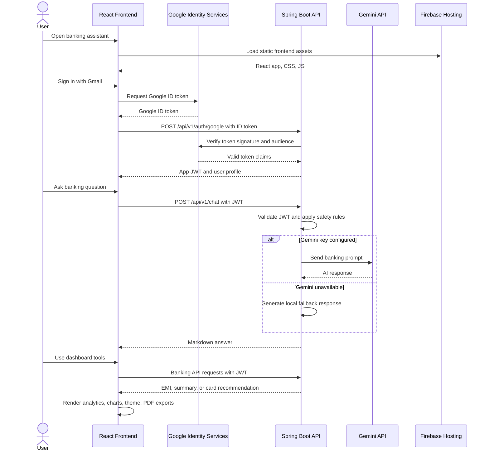

# AI Banking Assistant

AI Banking Assistant is a fintech POC that combines a React dashboard with a Spring Boot API for authenticated banking workflows, AI chat assistance, transaction analytics, EMI calculation, savings coaching, credit card recommendations, and PDF report generation.

Live Firebase Hosting URL:

```text
https://ai-banking-assistant-6e91f.web.app
```

## POC Scope

- Gmail-based sign-in using Google Identity Services.
- Backend Google ID token verification and stateless JWT session handling.
- AI banking chat assistant with Markdown responses and a deterministic fallback when Gemini is not configured.
- Transaction analytics with monthly income, expenses, savings, category split, comparison cards, table view, and PDF export.
- EMI calculator for loan amount, interest rate, and tenure.
- Savings coach that parses plain-text salary and expense inputs and suggests monthly reductions.
- Credit card recommendation flow based on salary, spending habits, shopping preference, and travel frequency.
- Profile and settings pages with light/dark theme support.
- Firebase Hosting deployment for the frontend and Docker/Render-ready backend configuration.

## Tech Stack

| Layer | Technology |
| --- | --- |
| Frontend | React 18, TypeScript, Vite 5 |
| Styling | Tailwind CSS, custom CSS theme tokens, responsive dashboard layout |
| UI Libraries | Lucide React icons, Framer Motion, React Markdown |
| API Client | Axios |
| Backend | Java 21, Spring Boot 3.3 |
| Backend Modules | Spring Web, Spring Security, Bean Validation |
| Authentication | Google Identity Services, OAuth2 JOSE token verification, JWT with JJWT |
| AI Integration | Gemini API hook with local fallback responses |
| API Docs | Springdoc OpenAPI |
| Reports | Browser-generated PDF export |
| Deployment | Firebase Hosting for frontend, Render-ready backend config |
| Containers | Dockerfile, frontend/backend Dockerfiles, Docker Compose |

## High-Level Sequence Diagram



## Project Structure

```text
backend/
  src/main/java/com/aibank/assistant/
    config/
    controller/
    dto/
    entity/
    exception/
    security/
    service/
frontend/
  src/
    context/
    hooks/
    layout/
    pages/
    services/
    types/
docker/
docker-compose.yml
Dockerfile
firebase.json
render.yaml
```

## API Overview

| Method | Endpoint | Purpose |
| --- | --- | --- |
| POST | `/api/v1/auth/google` | Verify Google ID token and issue app JWT |
| POST | `/api/v1/chat` | Ask the AI banking assistant |
| GET | `/api/v1/chat/history` | Read chat history |
| DELETE | `/api/v1/chat/history` | Clear chat history |
| POST | `/api/v1/banking/transactions/summary` | Summarize transactions |
| POST | `/api/v1/banking/emi` | Calculate EMI |
| POST | `/api/v1/banking/cards/recommend` | Recommend a credit card |

## Local Development

### Backend

Use Java 21, then start Spring Boot:

```powershell
cd backend
mvn spring-boot:run
```

Backend URL:

```text
http://localhost:8080
```

### Frontend

PowerShell may block `npm.ps1`, so use `npm.cmd`:

```powershell
cd frontend
npm.cmd install
npm.cmd run dev
```

Frontend URL:

```text
http://localhost:5173
```

## Environment Variables

Backend variables are documented in [backend/.env.example](backend/.env.example).

Required or commonly used backend values:

- `GOOGLE_CLIENT_ID`
- `GEMINI_API_KEY`
- `JWT_SECRET`

Frontend variables are documented in [frontend/.env.example](frontend/.env.example).

Required or commonly used frontend values:

- `VITE_API_URL`
- `VITE_GOOGLE_CLIENT_ID`

## Build

```powershell
cd frontend
npm.cmd run build
```

The production frontend is written to:

```text
frontend/dist
```

## Docker

```powershell
docker compose up --build
```

This starts the backend and frontend containers using the repository Docker configuration.

## Deployment

### Frontend

Firebase Hosting is configured in [firebase.json](firebase.json) and serves `frontend/dist`.

```powershell
npm.cmd run build
npx firebase-tools deploy --only hosting --project ai-banking-assistant-6e91f --non-interactive
```

### Backend

The backend is prepared for Render using [render.yaml](render.yaml). Configure secrets in the Render dashboard instead of committing them.

## Notes

- The POC uses static sample transactions for dashboard analytics.
- No database is required for the current POC scope.
- Gemini is optional; the backend remains usable with deterministic fallback responses.
- Generated build folders, logs, local IDE settings, and Firebase cache files are ignored by Git.
